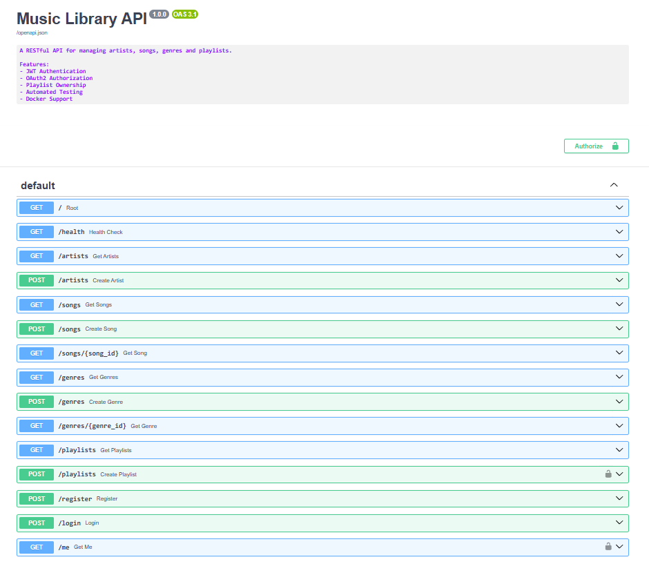

# 🎵 Music Library API


A modern RESTful API built with **FastAPI**, **SQLAlchemy**, **JWT Authentication**, **Docker**, and **PyTest**.

This project allows users to manage artists, songs, genres, and playlists while implementing authentication, authorization, automated testing, and containerization following backend development best practices.

## Swagger Documentation


---

## 🚀 Features

### Authentication & Authorization

* User registration
* Secure password hashing with bcrypt
* JWT authentication
* OAuth2 Password Flow
* Protected endpoints
* Current authenticated user retrieval
* User-owned playlists

### Music Library Management

* Artists CRUD
* Songs CRUD
* Genres CRUD
* Playlists CRUD
* Song-to-playlist assignment
* Duplicate song prevention
* Playlist ownership management

### Database Relationships

* One-to-Many

  * Artist → Songs
  * Genre → Songs
  * User → Playlists

* Many-to-Many

  * Playlists ↔ Songs

### Testing

* Authentication tests
* Authorization tests
* Artist endpoint tests
* Playlist endpoint tests
* JWT-protected route validation

### DevOps

* Docker containerization
* Docker Compose support
* GitHub Actions CI/CD
* Automated test execution on push

---

## 🛠️ Tech Stack

### Backend

* Python 3.12
* FastAPI
* SQLAlchemy
* SQLite

### Authentication

* JWT (JSON Web Tokens)
* OAuth2
* Passlib (bcrypt)

### Testing

* PyTest
* FastAPI TestClient

### DevOps

* Docker
* Docker Compose
* GitHub Actions

---

## 📂 Project Structure

```text
music-library-api/
│
├── app/
│   ├── auth.py
│   ├── crud.py
│   ├── database.py
│   ├── main.py
│   ├── models.py
│   └── schemas.py
│
├── tests/
│   ├── test_auth.py
│   ├── test_artists.py
│   └── test_playlists.py
│
├── .github/
│   └── workflows/
│       └── tests.yml
│
├── Dockerfile
├── docker-compose.yml
├── requirements.txt
├── README.md
└── .gitignore
```

---

## ⚙️ Local Installation

Clone the repository:

```bash
git clone https://github.com/gebreGL/music-library-api.git
cd music-library-api
```

Create and activate a virtual environment:

### Windows

```bash
python -m venv venv
venv\Scripts\activate
```

### Linux / macOS

```bash
python -m venv venv
source venv/bin/activate
```

Install dependencies:

```bash
pip install -r requirements.txt
```

Run the API:

```bash
uvicorn app.main:app --reload
```

---

## 🐳 Docker

Build and run the application:

```bash
docker compose up --build
```

The API will be available at:

```text
http://localhost:8000
```

---

## 📖 API Documentation

Swagger UI:

```text
http://localhost:8000/docs
```

ReDoc:

```text
http://localhost:8000/redoc
```

---

## 🔐 Authentication Flow

### Register

```http
POST /register
```

### Login

```http
POST /login
```

Returns:

```json
{
  "access_token": "JWT_TOKEN",
  "token_type": "bearer"
}
```

### Authorize

Use the token through Swagger's **Authorize** button.

Authenticated users can create playlists automatically associated with their account.

---

## 🧪 Running Tests

Run all tests:

```bash
pytest
```

Run tests with coverage:

```bash
pytest --cov=app
```

---

## 🔄 Continuous Integration

Every push to the repository automatically triggers:

* Dependency installation
* Test execution
* CI validation through GitHub Actions

---

## 🎯 Learning Goals

This project was created to strengthen skills in:

* REST API development
* Backend architecture
* Database modeling
* Authentication & Authorization
* Automated testing
* Docker containerization
* Continuous Integration (CI/CD)
* Git workflow and branching strategies

---

## 🚧 Future Improvements

* PostgreSQL integration
* Alembic migrations
* User favorites system
* Advanced song filtering and search
* Playlist sharing
* Recommendation engine
* API versioning

---

## 👨‍💻 Author

**Gebre Gutiérrez**

GitHub: https://github.com/gebreGL

---

## 📄 License

This project is intended for educational and portfolio purposes.
